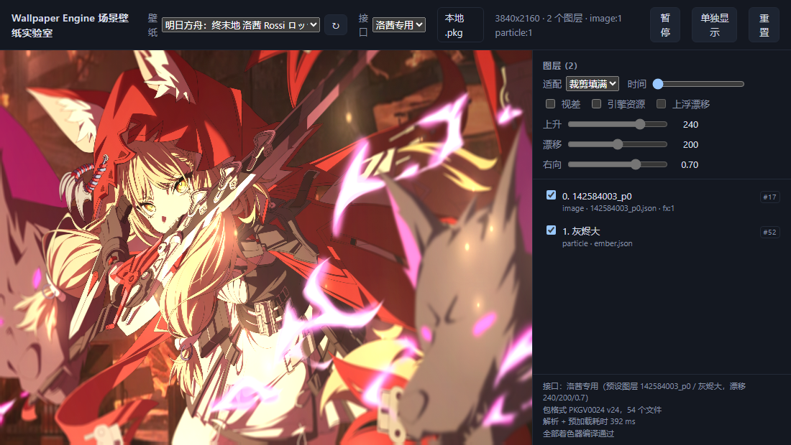

# Wallpaper Scene Layered Rendering

**Wallpaper 场景壁纸分层渲染** —— 把 Wallpaper Engine 的场景壁纸拆解成一个个独立图层，
在浏览器里**分层渲染**（WebGL2，零依赖），并且**可以手动选择只渲染其中某几层**。

- 纯浏览器端解析：`PKGV` 包容器、`scene.json`、模型 / 材质 / 特效 / 粒子预设、`.tex` 纹理，**不需要安装 Wallpaper Engine**；
- 每个 object 都是一个图层，可读取、显示 / 隐藏、单独渲染、按需筛选——是分层的工具库，不是黑盒播放器；
- 零依赖、纯 ESM，可被打包器引用，也可直接 `<script type="module">` 引入；
- 可选**把整条渲染管线放进 worker**（OffscreenCanvas）：主线程只留画布与输入，宿主界面卡住时壁纸照常播放。

## 定位：通用分层渲染 + 洛茜壁纸专用适配

|                  | 说明                                                                                                                                                                                                                                            |
| ---------------- | ----------------------------------------------------------------------------------------------------------------------------------------------------------------------------------------------------------------------------------------------- |
| **通用能力**     | 解析并分层渲染**任意**场景壁纸：`scene.pkg`（PKGV0001…0024）或未打包的工程目录；图层可以逐个读取、隐藏、隔离、筛选                                                                                                                              |
| **主要适配对象** | **洛茜壁纸** —— [Steam 创意工坊 · 3691554683](https://steamcommunity.com/sharedfiles/filedetails/?id=3691554683)<br>项目为它准备了专门的接口（接口二）与预设：只保留背景美术与 `灰烬大` 图层，粒子开启上升 240 / 漂移 200 / 右移 0.7 的上浮漂移 |
| **素材分发**     | **本项目不分发该壁纸**。仓库里不含任何壁纸素材（`fixtures/` 已在 `.gitignore` 中），也不包含 Wallpaper Engine 的引擎资源；请在 Steam 创意工坊**订阅**该壁纸后自行取得 `scene.pkg`，本项目只提供适配代码                                         |



_上图为**接口二**（洛茜专用）在无头 Chrome 中的渲染：只加载背景美术 `142584003_p0` 与粒子层 `灰烬大`，
时钟文字、音频卡片、可视化条、`灰烬光束` 等图层都不会被加载。_

## 两个接口

| 接口                                       | 用途                                                        |
| ------------------------------------------ | ----------------------------------------------------------- |
| **接口一** `createWallpaper(options)`      | 通用加载：任何场景壁纸，参数全开放                          |
| **接口二** `createRossiWallpaper(options)` | **洛茜壁纸专用**：等于接口一 + 预设参数，传同名参数即可覆盖 |

```ts
import {
  createWallpaper,
  createRossiWallpaper,
  ROSSI_WALLPAPER,
} from "wallpaper-scene-layers";

// 接口一：普通加载（全部图层）
const generic = await createWallpaper({ canvas, source: "rossi.pkg" });

// 接口二：洛茜专用 —— 图层只留背景美术 + 灰烬大，粒子用预设漂移
const rossi = await createRossiWallpaper({ canvas, source: "rossi.pkg" });

console.log(ROSSI_WALLPAPER);
// {
//   name: "洛茜 Rossi",
//   layers:    { include: ["142584003_p0", "灰烬大"] },
//   particles: { drift: { rise: 240, speed: 200, forwardRatio: 0.7 } }
// }
```

## 手动选择渲染哪些图层

三种方式，从「加载前就排除」到「运行时临时隐藏」：

```ts
// 1) 加载时就只保留指定图层（id 或名称）：被排除的图层连贴图都不加载、着色器也不编译
await createWallpaper({
  canvas,
  source: "rossi.pkg",
  layers: {
    include: ["142584003_p0", "灰烬大"], // 只保留这两层
    exclude: ["Simple Visualizer"], // 或者排除某些层（连同子层）
  },
});

// 2) 运行时逐层控制
wallpaper.setLayerVisible(44, false); // 按 id
wallpaper.setLayerVisible("灰烬光束", false); // 按名称

// 3) 自己读图层清单再决定
console.table(
  wallpaper.layers.map((l) => ({ id: l.id, name: l.name, type: l.type })),
);
```

被保留图层的祖先会自动保留，父子变换链不会断；`layers` 筛选发生在渲染器创建之前，
所以被排除的图层不会占用显存、也不会编译它们的着色器。

测试环境里对应的是：右侧图层列表的勾选框、点击某层「单独显示」、以及控制栏的「接口」下拉框。

## 不卡主线程：worker 渲染

默认接口 `createWallpaper()` 在主线程上画。库另外提供 `createWorkerWallpaper()`：下载、解析
`scene.pkg`、解码 `.tex`、编译着色器、粒子模拟与每一帧绘制全部在 worker 里，主线程只负责把画布
移交出去、转发尺寸与指针。

```ts
import { createWorkerWallpaper } from "wallpaper-scene-layers";

const wallpaper = await createWorkerWallpaper({ canvas, source: "scene.pkg" });
wallpaper.setLayerVisible("灰烬光束", false);   // 消息发给 worker
await wallpaper.warmUp(14);                      // 预热到 t=14s（封面 / 截图）
```

* 帧循环由 worker 自己的定时器推动，**主线程被占住时壁纸照常播放**（实测：主线程卡死 2 秒，
  主线程渲染 0 帧，worker 渲染 66–68 帧）；
* 同样输入下两条路径**逐像素一致**（1280×720 最大通道差值 0，用 `?layers=` 排除粒子层后对比）；
* 环境不支持 OffscreenCanvas 时自动退回主线程渲染，返回对象形状不变；
* 洛茜壁纸对应 `createRossiWorkerWallpaper()`，参数与接口二一致。

完整说明（两个驱动模式、宿主侧 API、打包器接法、「一块画布只能移交一次」等注意事项）见
[`packages/we-scene/README.md`](packages/we-scene/README.md) 的「把渲染放进 worker」一节；
测试环境里点控制栏的「worker 渲染」或加 `?worker=1` 即可切换。

## 快速开始

```bash
npm install
npm run build          # 用 tsc 编译库到 packages/we-scene/dist
npm run testbed        # 启动静态服务器 http://127.0.0.1:5180/testbed/web/
```

打开 <http://127.0.0.1:5180/testbed/web/>：左侧实时渲染，右侧列出全部图层（类型、资产、特效数量），
带显隐开关，点击即可单独隔离；控制栏的「接口」可切换**普通加载 / 洛茜专用**，
「壁纸」下拉框可切换 `fixtures/` 下的多张壁纸，也能直接拖入本机 `.pkg`。

命令行：

```bash
node packages/we-scene/bin/we-scene.mjs scene.pkg                 # 打印图层清单
node packages/we-scene/bin/we-scene.mjs scene.pkg --json layers.json
node packages/we-scene/bin/we-scene.mjs scene.pkg --out build/extracted --tex
npm run verify                                                    # 校验解析 + 纹理解码 + 粒子位移
npm run presets                                                   # 扫描本机引擎自带的 240 个粒子预设
```

## 仓库构成：库 / 测试分离

```
wallpaper-scene-layers/
├── packages/we-scene/     ★ 对外发布的库（其他项目只需要这一个目录）
│   ├── src/               源码（TypeScript，零依赖）
│   │   └── presets/rossi.ts   接口二：洛茜壁纸预设
│   ├── bin/               we-scene 命令行（图层导出 / 纹理解码）
│   ├── dist/              构建产物（ESM + .d.ts，包的入口）
│   ├── README.md          库文档（完整 API、格式说明、着色器兼容、已知限制）
│   └── LICENSE
├── testbed/               ☆ 测试与演示，不发布，只依赖 packages/we-scene/dist
│   ├── server.mjs         静态服务器
│   ├── web/               浏览器测试环境（实验室 / 对比页 / 着色器探针）
│   └── scripts/           Node 端校验（verify.mjs）与无头截图（snapshot.mjs）
├── fixtures/              测试素材（scene.pkg / 未打包工程）—— 不入库，见 fixtures/README.md
├── docs/screenshots/      文档用截图
├── build/                 生成物（解包结果、截图），已 gitignore
└── LICENSE / README.md / package.json
```

- **`packages/we-scene/` 是被其他项目调用的代码**——它不引用仓库里任何其他目录，可以单独复制或安装；
- **`testbed/` 只是使用者之一**——它和外部项目一样通过 `packages/we-scene/dist/index.js` 引入库，测试同时也在验证打包产物；
- **`fixtures/` 是测试输入**，**`build/` 是生成物**，都不属于源码。

## 库用法

```ts
import { createWallpaper } from "wallpaper-scene-layers";

const wallpaper = await createWallpaper({ canvas, source: "scene.pkg" });

console.table(
  wallpaper.layers.map((l) => ({ id: l.id, name: l.name, type: l.type })),
);
wallpaper.setLayerVisible(44, false); // 隐藏某层
wallpaper.stop(); // 暂停渲染循环
wallpaper.renderFrame(12); // 只渲染 t=12s 的一帧
```

完整 API、包 / 纹理格式说明、着色器兼容策略与已知限制见 [`packages/we-scene/README.md`](packages/we-scene/README.md)。

### 可选：读取本机引擎资源

引擎内置的贴图 / 材质 / 着色器头文件不在场景包里，默认用程序化近似（实测亮度误差 0.4%–8%）。
本机装了 Wallpaper Engine 时，打开开关即可改用引擎的真实文件（库不包含也不分发这些资源）：

```ts
await createWallpaper({
  canvas,
  source: "scene.pkg",
  engineAssets: "/we-assets/",
}); // 浏览器
await createWallpaper({ canvas, source, engineAssets: {} }); // Node 自动探测
```

## 渲染管线

```
scene.pkg ──parsePackage──▶ PackageArchive ──▶ scene.json ──▶ SceneDocument.layers（33 层）
     │                                            │
     │                                            ├─ models/*.json ─▶ materials/*.json ─▶ .tex
     │                                            ├─ effects/*/effect.json ─▶ shaders/*.frag|.vert（GLSL）
     │                                            └─ particles/*.json ─▶ materials/presets/*.json
     ▼
  .tex ──LZ4 + BC1/2/3 + PNG──▶ GL 纹理 ──▶ SceneRenderer（WebGL2，特效走 FBO ping-pong）
```

单个图层的绘制顺序：

1. 沿父链求出模型矩阵（`origin / angles / scale` 逐级相乘），按 `alignment` 与模型 `cropoffset` 摆好四边形；
2. 有特效时先画进该图层屏幕包围盒大小的 FBO（用世界坐标包围盒做正交投影，像素包围盒决定 FBO 尺寸）；
3. 按 `effect.json` 的 `passes` 依次执行全屏 pass，支持 ping-pong、pass 自定义 `target`、`bind` 重映射与 `constantshadervalues`；
4. 把最终 FBO 按原包围盒合成回屏幕。没有特效的图层直接画到屏幕。

## 对洛茜壁纸的验证

- 解析出 **33 个图层**（image 12 / text 15 / solid 4 / particle 2），接口一每帧实绘 26 层；接口二只实绘 **2 层**（背景美术 + `灰烬大`）；
- 4 张纹理全部解码：一条 3840×2160 的 PNG mip 链 + 3 张 LZ4 + BC3；
- 场景用到的 **11 个 shader / combo 组合全部编译通过**（水波、镂空、圆角遮罩、精确模糊、渐变混合、透明度、音频响应可视化）；
- 粒子（父系统 34 个 + 光束 22 个）由 CPU 模拟：curl noise 速度场驱动；接口二的上浮漂移实测 **37/37 个粒子上升**、平均垂直速度 248（对应 `rise: 240`）；
- 粒子与着色器语义对照了本机安装的 Wallpaper Engine 自带资源（`assets/shaders/genericparticle.vert`、`assets/materials/particle/*.tex`、`assets/presets/**`），并用 `npm run presets` 扫描引擎自带的 **240 个粒子预设**：解析/模拟失败 0；
- 粒子组件的**默认值已按官方取值固化进源码**（`src/render/particle-defaults.ts`，80 余项，逐条标注出处）；
- 包内 CJK 字体文字、每个 effect pass 均由无头 Chrome 截图确认。

| 截图                                  | 内容                                                          |
| ------------------------------------- | ------------------------------------------------------------- |
| `docs/screenshots/api-rossi.png`      | **接口二**：只有背景美术 + 灰烬大（实验室里切换接口后的画面） |
| `docs/screenshots/lab-ui.png`         | 实验室界面：渲染画面 + 图层面板                               |
| `docs/screenshots/rendered-scene.png` | **接口一**：t=14s 的完整场景（含时钟、音频卡片、特效与粒子）  |
| `docs/screenshots/layer-variants.png` | 仅背景层 / 背景 + 水波 / 全图层（关特效与开特效）对比         |
| `docs/screenshots/particles.png`      | 只渲染粒子层（黑底，t=14s）：散布的灰烬光点                   |

## 许可

代码 [MIT](LICENSE) © Moistrocic。

- **壁纸素材**：本仓库**不包含也不分发**任何壁纸。文档与截图里出现的洛茜壁纸
  （[创意工坊 3691554683](https://steamcommunity.com/sharedfiles/filedetails/?id=3691554683)）
  及 Wallpaper Engine 官方模板，版权归各自作者所有，仅用于说明本库的适配与渲染效果；
- **引擎资源**：`.tex` / 材质 / 着色器头文件等 Wallpaper Engine 自带资源同样不随本项目分发，
  需要时由使用者在**本机**通过 `engineAssets` 读取自己的安装。
